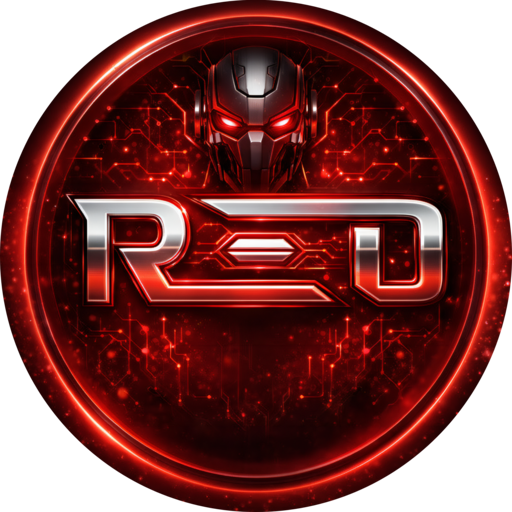

<p align="center">
  
</p>

<h1 align="center">RED Systems Unified VM</h1>

<p align="center">
  <strong>Repositorio oficial da stack consolidada em uma VM unica: portal, dashboard, proxy IA, RED I.A, RED Trader, OpenClaw, Rapidleech, monitor SEB e bridge da extensao IQ.</strong>
</p>

---

## Visao geral

Hoje a RED Systems roda com uma arquitetura de VM unica. O objetivo deste repositorio e manter codigo, infra, documentacao e rotina operacional contando a mesma historia.

### Rotas publicas atuais

- `/` -> portal
- `/dashboard/` -> painel principal
- `/proxy/` -> proxy IA oficial
- `/ollama/` -> alias do proxy IA
- `/redia/` -> runtime standalone da RED I.A
- `/trader/` -> RED Trader
- `/proxy-lab/` -> laboratorio de benchmark
- `/iq-bridge/` -> bridge da extensao IQ
- `/openclaw/` -> assistente operacional privado
- `/rapidleech/` -> transfer hub legado oficializado
- `:2580` -> RED SEB Monitor

### Servicos principais

| Servico | Caminho | Runtime oficial na VM | Service |
|---|---|---|---|
| Portal | `servicos/portal` | `/var/www/red-portal` | nginx |
| Dashboard | `servicos/dashboard` | `/opt/redvm-dashboard` | `red-dashboard.service` |
| Proxy IA | `servicos/proxy` | `/opt/redvm-proxy` | `red-ollama-proxy.service` |
| RED I.A | `servicos/redia` | `/opt/redia` | `redia.service` |
| RED Trader | `servicos/redtrader` | `/opt/redtrader` | `redtrader.service` |
| OpenClaw | `servicos/openclaw` | `/opt/red-openclaw` | `red-openclaw.service` |
| Proxy Lab | `servicos/proxy-lab` | `/opt/red-proxy-lab` | `red-proxy-lab.service` |
| Rapidleech | `servicos/rapidleech` | `/opt/rapidleech` | `rapidleech.service` |
| RED SEB Monitor | `servicos/redseb-monitor` | `/opt/red-seb-monitor` | `red-seb-monitor.service` |
| IQ Bridge | `servicos/extensao-iq-demo/bridge` | `/opt/red-iq-vision-bridge` | `red-iq-vision-bridge.service` |
| Deploy Agent | `servicos/deploy-agent` | legado | `red-webhook.service` |

---

## Mapa do repositorio

```text
servicos/
  portal/                Home publica
  dashboard/             Painel principal da VM unica
  proxy/                 Proxy IA oficial
  proxy-lab/             Laboratorio pago e experimental
  redia/                 Runtime da RED I.A
  redtrader/             Trader demo e paper
  openclaw/              Assistente operacional privado
  rapidleech/            Transfer hub legado oficializado
  redseb-monitor/        Painel remoto do ecossistema SEB
  extensao-iq-demo/      Extensao Chrome e IQ Bridge
  extensao-iq-motor-lab/ Motor de laboratorio remoto para IQ
  deploy-agent/          Legado

infraestrutura/
  nginx/                 Friendly paths e reverse proxy
  systemd/               Units oficiais
  scripts/               Apoio de infra
  docker/                Artefatos auxiliares e legados

ferramentas/
  vm/                    Paramiko, execucao remota e migracao
  iq_vision_benchmark/   Benchmarks visuais da IQ
  red_model_studio/      App desktop para testar modelos
  redclaudecode/         Launcher do Claude Code

documentacao/
  arquitetura.md
  implantacao-servicos.md
  manual-completo.md
  preparacao-vm.md
```

---

## Como instalar a stack em uma VM nova

### 1. Dependencias base da VM

Em uma VM Ubuntu ou Debian limpa, comece com:

```bash
apt-get update
apt-get install -y \
  git curl rsync nginx ufw \
  python3 python3-venv python3-pip \
  nodejs npm ffmpeg \
  sqlite3 jq
```

Se a VM for usar OpenClaw no mesmo desenho da RED, instale tambem um runtime Node 24 dedicado para ele.

### 2. Clone o repositorio

```bash
git clone <repo-url> /srv/redvm
cd /srv/redvm
```

### 3. Instale servico por servico

Cada servico agora tem um guia proprio de instalacao em qualquer VM:

- [servicos/portal/README.md](servicos/portal/README.md)
- [servicos/dashboard/README.md](servicos/dashboard/README.md)
- [servicos/proxy/README.md](servicos/proxy/README.md)
- [servicos/proxy-lab/README.md](servicos/proxy-lab/README.md)
- [servicos/redia/README.md](servicos/redia/README.md)
- [servicos/redtrader/README.md](servicos/redtrader/README.md)
- [servicos/openclaw/README.md](servicos/openclaw/README.md)
- [servicos/rapidleech/README.md](servicos/rapidleech/README.md)
- [servicos/redseb-monitor/README.md](servicos/redseb-monitor/README.md)
- [servicos/extensao-iq-demo/README.md](servicos/extensao-iq-demo/README.md)
- [servicos/extensao-iq-motor-lab/README.md](servicos/extensao-iq-motor-lab/README.md)
- [servicos/deploy-agent/README.md](servicos/deploy-agent/README.md)

Regra pratica:

1. instalar dependencias do servico
2. copiar para o runtime oficial em `/opt/...` ou `/var/www/...`
3. criar `.env` ou `EnvironmentFile`
4. instalar a unit systemd quando houver
5. publicar no nginx quando houver rota publica
6. validar por sintaxe, `systemctl` e HTTP ou UI

---

## Runtime paths oficiais

### Codigo

- dashboard: `/opt/redvm-dashboard`
- proxy: `/opt/redvm-proxy`
- redia: `/opt/redia`
- redtrader: `/opt/redtrader`
- openclaw: `/opt/red-openclaw`
- rapidleech: `/opt/rapidleech`
- proxy-lab: `/opt/red-proxy-lab`
- red seb monitor: `/opt/red-seb-monitor`
- iq bridge: `/opt/red-iq-vision-bridge`
- portal: `/var/www/red-portal`

### Dados

- dashboard: `/opt/redvm-dashboard/data`
- proxy: `/var/lib/redvm-proxy`
- redia: `/opt/redia/data`
- redtrader: `/opt/redtrader/data`
- proxy-lab: `/opt/red-proxy-lab/data`
- rapidleech files: `/opt/rapidleech/files`
- red seb monitor downloads: `/opt/red-seb-monitor/data/downloads`
- iq bridge: `/opt/red-iq-vision-bridge/data`

---

## Nginx

O arquivo central do include publico e `infraestrutura/nginx/red-friendly-paths.nginx.conf`.

Ele concentra as rotas amigaveis:

- `/`
- `/dashboard/`
- `/proxy/`
- `/ollama/`
- `/redia/`
- `/trader/`
- `/proxy-lab/`
- `/iq-bridge/`
- `/openclaw/`
- `/rapidleech/`

Sempre que mexer em nginx:

```bash
nginx -t
systemctl reload nginx
```

---

## Dashboard principal

O dashboard e o centro operacional da stack.

Subrotas canonicas:

- `/dashboard/`
- `/dashboard/servicos`
- `/dashboard/docker`
- `/dashboard/proxyia`
- `/dashboard/redia`
- `/dashboard/projetos`
- `/dashboard/logs`
- `/dashboard/terminal`
- `/dashboard/arquivos`
- `/dashboard/firewall`
- `/dashboard/processos`

Se mexer na navegacao dele:

1. alinhe frontend, backend e template
2. preserve `pushState` e `popstate`
3. valide login e pelo menos duas subrotas reais

---

## RED I.A

A RED I.A continua existindo como runtime proprio em `/redia/`, mas o caminho principal de operacao hoje e o dashboard principal em `/dashboard/redia`.

Ela depende de:

- proxy RED como backend IA
- token admin correto para o dashboard conversar com o runtime
- WhatsApp e Baileys quando o canal estiver ativo

---

## RED Trader

O RED Trader hoje e demo e paper e deve ser tratado assim.

Estado atual importante:

- feed da IQ via extensao e bridge
- sem depender da API comunitaria antiga como caminho principal
- painel em `/trader/`

---

## Extensao IQ Demo

O bloco IQ e composto por:

- extensao principal `servicos/extensao-iq-demo`
- bridge `servicos/extensao-iq-demo/bridge`
- extensao de laboratorio `servicos/extensao-iq-motor-lab`

Uso recomendado:

1. testar comportamento novo no `motor-lab`
2. observar resultado no bridge
3. portar so o que prestou para a principal

Fonte principal de verdade:

- transporte da pagina
- `active_id`
- payout por id
- `positions-state` e portfolio

Nao confiar so em OCR ou DOM superficial.

---

## OpenClaw

OpenClaw roda como assistente operacional privado da RED.

Papel esperado:

- chatops
- operacao de host
- uso do proxy RED como backend de modelos
- integracao privada por WhatsApp

Ele nao substitui:

- dashboard
- RED I.A
- proxy
- RED Trader

---

## Fluxo recomendado de trabalho

1. entender o estado atual do repo
2. entender o estado atual da VM
3. editar localmente
4. validar sintaxe e checks
5. fazer backup remoto
6. subir o minimo necessario
7. reiniciar so o servico tocado
8. validar via `systemctl`, HTTP e UI real quando fizer sentido

---

## Deploy remoto

O helper padrao do repo e:

```bash
python ferramentas/vm/paramiko_exec.py "systemctl status red-dashboard --no-pager"
```

Com credenciais por ambiente:

```bash
export REDSYSTEMS_HOST=redsystems.ddns.net
export REDSYSTEMS_SSH_PORT=22
export REDSYSTEMS_SSH_USER=root
export REDSYSTEMS_SSH_PASSWORD=...
```

Sempre faca backup remoto antes de sobrescrever runtime.

Exemplos:

- `/root/backups/dashboard-YYYYMMDD-HHMMSS.tgz`
- `/root/backups/proxy-YYYYMMDD-HHMMSS.tgz`
- `/root/backups/openclaw-YYYYMMDD-HHMMSS.tgz`

---

## Seguranca e segredos

Nunca commite:

- senhas
- tokens
- chaves de API
- cookies
- QR payloads
- dumps sensiveis

Locais aceitos para segredo real:

- `.env.local`
- `AGENTS.local.md`
- `.privado/`

Checagem recomendada antes de commit:

```bash
rg -n "(g[h]p_|n[v]api-|g[s]k_|api_key|password|senha|token|secret)" -S .
git status --short --ignored
```

---

## Documentacao complementar

- [AGENTS.md](AGENTS.md)
- [servicos/README.md](servicos/README.md)
- [infraestrutura/README.md](infraestrutura/README.md)
- [documentacao/preparacao-vm.md](documentacao/preparacao-vm.md)
- [documentacao/implantacao-servicos.md](documentacao/implantacao-servicos.md)
- [documentacao/manual-completo.md](documentacao/manual-completo.md)

Se a documentacao e o runtime divergirem, trate isso como bug e alinhe os dois lados.
